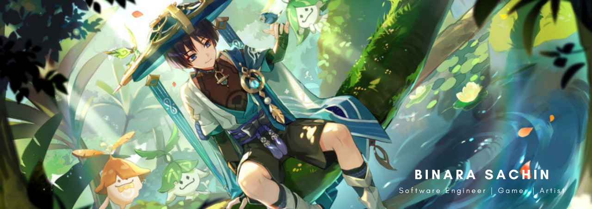

<!-- About Me -->
<h2>
    
    <b> About Me </b>
</h2>

```
{
    "name": "Binara Sachin",
    "work": "Software Engineer (IAM) @ WSO2",
    "education": [
        "MSc. Advanced Software Engineering - University of Westminster, UK",
        "BSc. (hons) Engineering - University of Moratuwa, SL"
    ],
    "interests": [
        "Identity and Access Management",
        "Mobile Development",
        "Game Development"
    ],
    "languages": ["Java", "Flutter", ".NET"],
    "hobbies": ["Anime", "Gaming", "Chess"]
}
```

<!-- Tools and Technologies -->
<h2>
     
    <b> Tools and Technologies </b>
</h2>

<div align="center">
    
    
    
    
    
</div>


 <!-- Blog posts -->
 <h2>
     
    <b> Blog Posts </b>
</h2>

<!-- BLOG-POST-LIST:START -->
- [Configure an OpenLDAP as the Primary UserStore in the WSO2 Identity Server](https://medium.com/@binara.sachin/configure-an-openldap-as-the-primary-userstore-in-the-wso2-identity-server-6ed75b9b13d?source=rss-4b8aee6079f3------2)
<!-- BLOG-POST-LIST:END -->

<details>
    <summary>
        <h2>
            
            <b> Github Stats </b>
        </h2>
    </summary>
    <div align="center">
        <picture>
            <source srcset="https://github-readme-stats.vercel.app/api?username=Binara-Sachin&show_icons=true&theme=dark" media="(prefers-color-scheme: dark)" />
            
        </picture>
        <picture>
            <source srcset="https://github-readme-stats.vercel.app/api/top-langs/?username=Binara-Sachin&layout=compact&theme=dark" media="(prefers-color-scheme: dark)" />
            
        </picture>
    </div>
</details>

<!-- Connect With Me -->
<h2>
    <b>🤝 Connect with Me </b>
</h2>

<div align="center" style="margin-left: 10px;">
    <a style="margin-left: 10px;" target="_blank" href="https://www.linkedin.com/in/binara-sachin/">
        
    </a>
    <a style="margin-left: 10px;" target="_blank" href="https://github.com/Binara-Sachin">
        
    </a>
    <a style="margin-left: 10px;" target="_blank" href="https://stackoverflow.com/users/10943050/binara-sachin">
        
    </a>
    <a style="margin-left: 10px;" target="_blank" href="https://leetcode.com/binara_sachin/">
        
    </a>
    <a style="margin-left: 10px;" target="_blank" href="https://www.instagram.com/binara_sachin/">
        
    </a>
</div>

---
<p align="center"> 
    
</p>

<!--
**Binara-Sachin/Binara-Sachin** is a ✨ _special_ ✨ repository because its `README.md` (this file) appears on your GitHub profile.
-->
